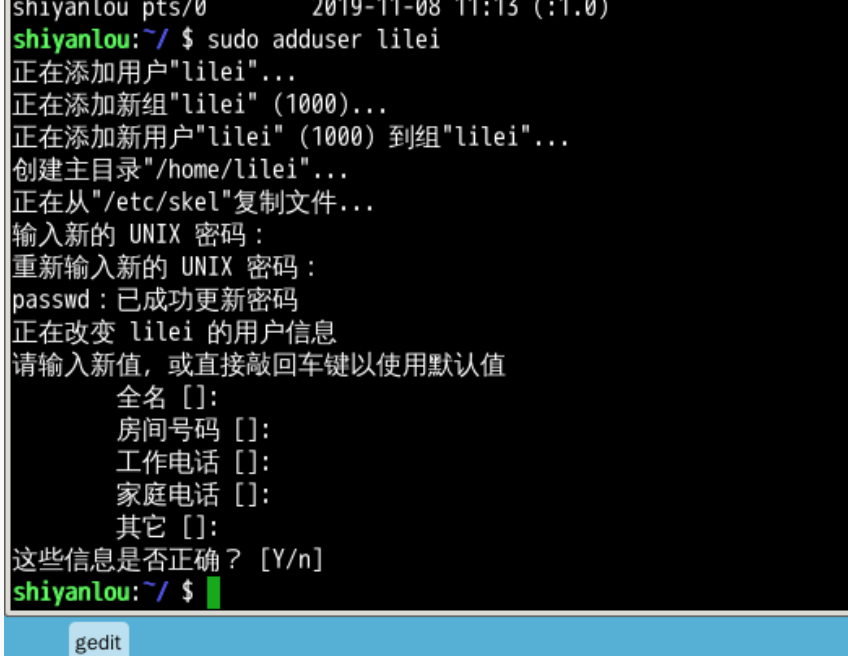
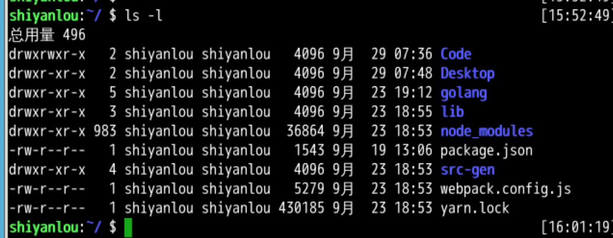
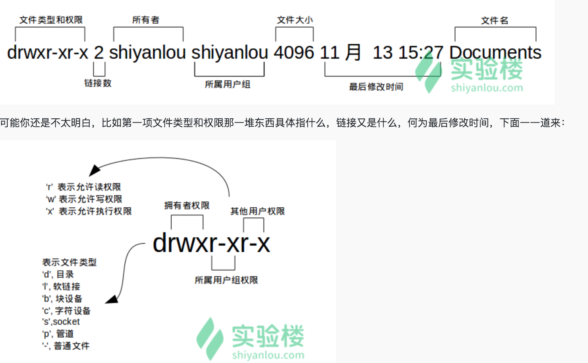
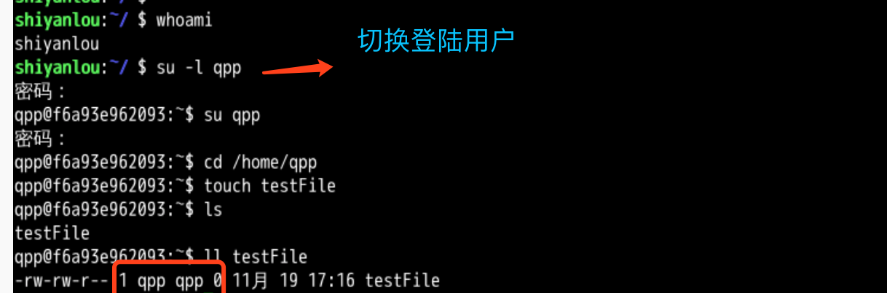

<!--
 * @Author: shouxie
 * @Date: 2019-11-08 11:16:30
 * @Description: 
 -->
 ##### 添加用户
```shell
sudo adduser qpp
```



这个命令不但可以添加用户到系统，同时也会默认为新用户创建 home 目录
```shell
ls /home
# 切换登陆用户
su -l qpp
# psw
# 查看当前打开窗口的用户
who am i
# 查看当前登陆用户
whoami
# 退出 或者exit
psw
```

##### 用户组
```shell
# 查看用户属于哪些用户组
groups qpp
# userName: groupName
```
每次新建用户如果不指定用户组的话，默认会自动创建一个与用户名相同的用户组

```shell
cat /etc/group | sort
```

cat 命令用于读取指定文件的内容并打印到终端输出; | sort 表示将读取的文本进行一个字典排序再输出

删除用户
```shell
sudo deluser qpp --remove-hom
```

##### 文件权限

Unix/Linux系统是一个典型的多用户系统，不同的用户处于不同的地位，对文件和目录有不同的访问权限

##### 查看文件权限
```shell
ls -l
```





##### 文件类型

<font color="#f00"> Linux 里面一切皆文件</font>

**设备文件**：  /dev 目录下有各种设备文件，大都跟具体的硬件设备相关

**socket**：网络套接字

**pipe 管道**

**软链接文件**： 链接文件分为两种，另一种是“硬链接”（硬链接不常用，而软链接等同 Windows上快捷方式）

##### 文件权限

读权限，表示你可以使用 cat <file name> 之类的命令来读取某个文件的内容；写权限，表示你可以编辑和修改某个文件； 执行权限，通常指可以运行的二进制程序文件或者脚本文件，如同 Windows 上的 exe 后缀的文件，不过 Linux 上不是通过文件后缀名来区分文件的类型。你需要注意的一点是，一个目录同时具有读权限和执行权限才可以打开并查看内部文件，而一个目录要有写权限才允许在其中创建其它文件，这是因为目录文件实际保存着该目录里面的文件的列表等信息。
```shell
# 显示除了 .（当前目录）和 ..（上一级目录）之外的所有文件，包括隐藏文件（Linux 下以 . 开头的文件为隐藏文件)
#ls -Al
ls -A

# 查看某一个目录的完整属性，而不是显示目录里面的文件属性：
ls -dl <目录名>
# 显示所有文件大小，并以普通人类能看懂的方式呈现：其中小 s 为显示文件大小，大 S 为按文件大小排序
ls -AsSh
```

现在，换回到 shiyanlou 用户身份，使用以下命令变更文件所有者为 shiyanlou 
```shell
sudo chown shiyanlou testFile
```
##### 修改文件权限
(拥有者)(所属用户组)(其他用户)
rwxrwxrwx 777
r--r--r-- 444
rw------- 600
r(读))w(写)x(执行)  => 2^2 + 2^1 + 2^0 = 7
```shell
chomd 600 testFile
chomd go-rw testFile
#g(group),o(others),u(user) + 和 - 分别表示增加和去掉相应的权限
```