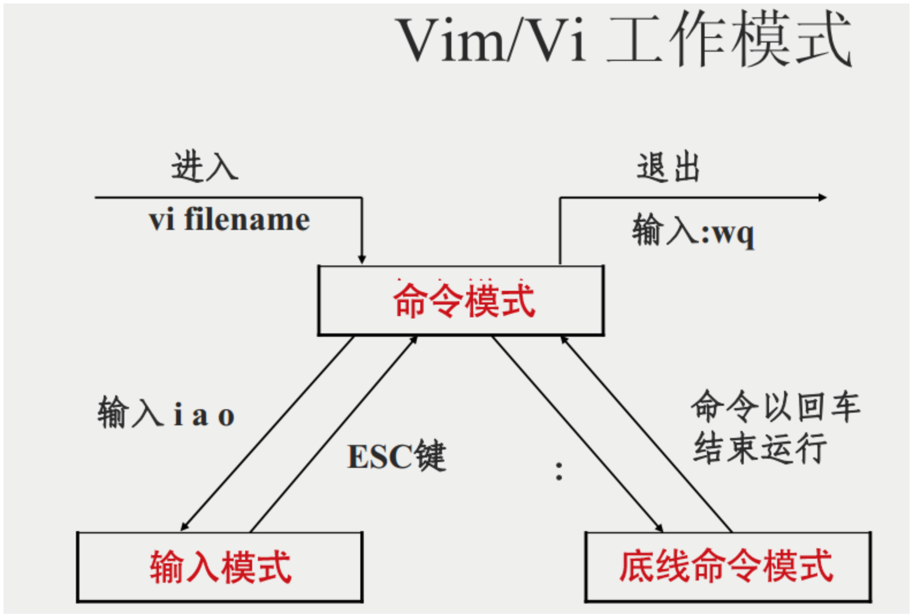

！！！！！！！！！还没完成

#### vi/vim 使用
> 基本上 vi/vim 共分为三种模式，分别是命令模式（Command mode），输入模式（Insert mode）和底线命令模式（Last line mode）。 这三种模式的作用分别是：

- 命令模式：
> 用户刚刚启动 vi/vim，便进入了命令模式。
此状态下敲击键盘动作会被Vim识别为命令，而非输入字符。比如我们此时按下i，并不会输入一个字符，i被当作了一个命令。

以下是常用的几个命令：

i 切换到输入模式，以输入字符。
x 删除当前光标所在处的字符。
: 切换到底线命令模式，以在最底一行输入命令。
若想要编辑文本：启动Vim，进入了命令模式，按下i，切换到输入模式。

命令模式只有一些最基本的命令，因此仍要依靠底线命令模式输入更多命令。

- 输入模式
在命令模式下按下i就进入了输入模式。
在输入模式中，可以使用以下按键：
**字符按键以及Shift组合**，输入字符

**ENTER**，回车键，换行

**BACK SPACE**，退格键，删除光标前一个字符

**DEL**，删除键，删除光标后一个字符

**方向键**，在文本中移动光标

**HOME/END**，移动光标到行首/行尾

**Page Up/Page Down**，上/下翻页

**Insert**，切换光标为输入/替换模式，光标将变成竖线/下划线

**ESC**，退出输入模式，切换到命令模式

- 底线命令模式
在命令模式下按下:（英文冒号）就进入了底线命令模式。
底线命令模式可以输入单个或多个字符的命令，可用的命令非常多。
在底线命令模式中，基本的命令有（已经省略了冒号）：

q 退出程序
w 保存文件
按ESC键可随时退出底线命令模式。

简单的说，我们可以将这三个模式想成底下的图标来表示：

##### 一般模式可用的光标移动、复制粘贴、搜索替换等
移动光标的方法
-|-|
-|-|
h 或 向左箭头键(←)|	光标向左移动一个字符|
j 或 向下箭头键(↓)|	光标向下移动一个字符|
k 或 向上箭头键(↑)|	光标向上移动一个字符|
l 或 向右箭头键(→)|	光标向右移动一个字符|

如果你将右手放在键盘上的话，你会发现 hjkl 是排列在一起的，因此可以使用这四个按钮来移动光标。 如果想要进行多次移动的话，例如向下移动 30 行，可以使用 "30j" 或 "30↓" 的组合按键， 亦即加上想要进行的次数(数字)后，按下动作即可！
-|-|
-|-|
[Ctrl] + [f]|	屏幕『向下』移动一页，相当于 [Page Down]按键 (常用)|
[Ctrl] + [b]	|屏幕『向上』移动一页，相当于 [Page Up] 按键 (常用)|
[Ctrl] + [d]	|屏幕『向下』移动半页|
[Ctrl] + [u]|	屏幕『向上』移动半页|
+	|光标移动到非空格符的下一行|
-	|光标移动到非空格符的上一行|
n<space>|	那个 n 表示『数字』，例如 20 。按下数字后再按空格键，光标会向右移动这一行的 n 个字符。例如 20<space> 则光标会向后面移动 20 个字符距离。|
0| 或功能键[Home]	这是数字『 0 』：移动到这一行的最前面字符处 (常用)|
$ 或功能键[End]|	移动到这一行的最后面字符处(常用)，不生效的话检查下是不是键盘英文状态|

------
vim--muke
下载安装
vim
刚进来是normal模式
#### 按键
- i insert（在光标前面插入）
- a append（在光标后面插入） 
- o open a line below（在下面开一行） 
- A append after line(在一行的最后插入)
- I insert before line(在一行的前面插入)
- O open a line above（在一行的上面新打开一行）
进入编辑模式
esc 退出到normal模式
:q 退出编辑器
:wq 写入并且退出

#### 模式：
编辑模式
普通模式
命令模式
:vs(vertical split) :sp(split)
:q 退出分屏啊啥的
:%s/要替换的字符/替换成哪个字符/g
:set nu 设置行号
可视模式（visual）
一般用来块状选择文本 
v 进入可视模式，V选择行 ctrl+v 块状选择

编辑模式:
ctrl+h 删除上一个字符 ctrl+w 删除上一个单词 ctrl+u删除当前行
快速退出到普通模式
ctrl+c 或者ctrl+[
快速进入编辑模式到上次修改的地方
gi

#### vim 快速移动
h 左
j 下
k 上
l 右
##### 单词直接移动：
w/W 移到下一个word/Word开头
e/E 移到下一个word/Word结尾
b/B 回退上一个word/Word开头
注： word：非空白符分割的单词，Word：空白符分割的单词
##### 行间移动搜索：搜索一个字符并快速移到这个字符
f字符 移动到字符上，t字符：移动到字符前一个字符；
如果第一次没有搜到，可以用;/,继续搜该行下一个/上一个，用在一行有重复字符的
F 表示反过来搜前面的字符
##### 快速移动到行首行尾
0 移动行首第一个字符 ^ 移动行首第一个非空白字符
$ 移动到行尾， g_ 移动行尾非空白字符
##### 页面移动
gg/G 移动到文件开头/结尾
ctrl+o快速返回
H/M/L 跳转到屏幕的开头head，中间middle，结尾lower
ctrl+u 下翻页
ctrl+f 上翻页
zz 屏幕中间
