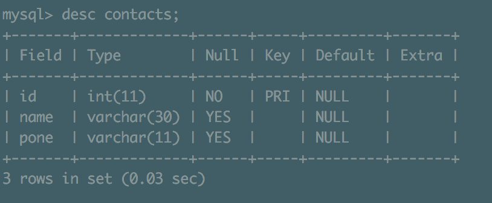
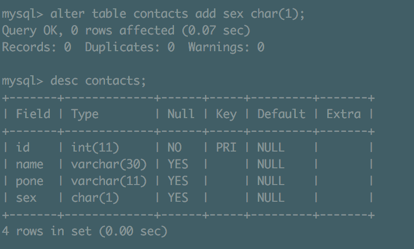
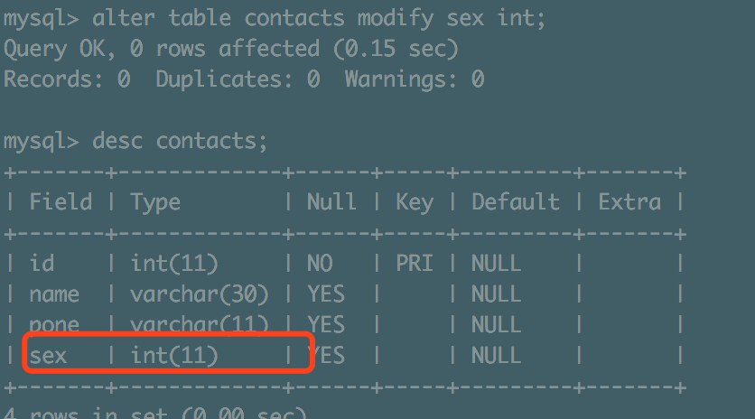
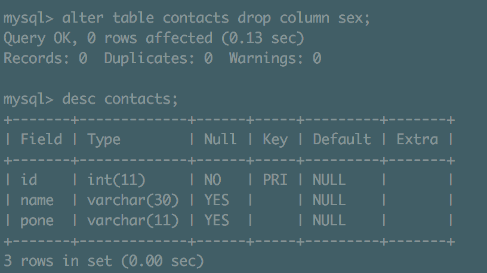

**SQL**是结构化查询语言。SQL是一门标准的计算机语言，
用于访问和操作数据库，其主能包括数据定义、数据操纵、数据查询和数据控制。
SQL已成为RDBMS的标准语言，但不同的RDBMS使用的SQL版本有一些差异，它们都有一些私有扩展。

#### 用途：
> 1. SQL可以创建和管理数据库、数据表、存储过程、视图等
> 2. SQL可以向数据库中插入新的记录，并可进行修改、删除
> 3. SQL可以查询数据库中的记录
> 4. SQL可以对数据库进行事务控制和权限管理

#### 分类
按照功能用途，可以将SQL语言分为4类：<font color="red">DDL、DML、DQL和DCL</font>
- <font color="red">DDL：</font>数据定义语言 Data Definition Language
DDL用于数据库、表、视图等的建立、删除。
DDL包括CREATE、ALTER、DROP等。
- <font color="red">DML：</font>数据操纵语言 Data Manipulation Language
DML用于添加、删除和修改数据表中的记录。
DML包括INSERT、DELETE和UPDATE。
- <font color="red">DCL：</font>数据控制语言 Data Control Language
DCL包括数据库对象的权限管理和事务管理。
DCL包括COMMIT、ROLLBACK、GRANT等。
- <font color="red">DQL：</font>数据查询语言 Data Query Language
查询是数据库的基本功能。
DQL中使用SELECT查询数据表中的记录。

在DDL中，对数据库的操作主要有两种：创建和删除

```sql
mysql -u root -p
# 查看当前有哪些数据库
show databases;
# 创建数据库
create database mydb;
# 删除数据库
drop database mydb;
# 查看当前使用的数据库
select database();
# 使用指定数据库
use mydb;
```

#### MySQL存储引擎
> 存储引擎，就是如何存储数据、如何更新数据、如何查询数据、如何为存储的数据建立索引等一系
列技术的实现方法。
```sql
#查看mysql支持的存储引擎
show engines; 
```
存储引擎|描述|
-|-|
**MyISAM** |**拥有较快的插入、查询速度，但不支持事务**|
**InnoDB**|**支持ACID事务，支持行级锁，支持外键；MySQL 5.5版本后的默认存储引擎**|
MRG_MYISAM|将一组结构相同的MyISAM表聚合成一个整体，再进行增删改查操作|
Memory|所有数据存储在内存中，响应快；MySQL重启时数据会全部丢失|
Archive|归档，且有压缩机制，适用于历史数据归档|
CSV|逻辑上由逗号分隔数据，会为每张表创建一个.csv文件|


#### MySQL数据类型
> 数值、日期/时间和字符串（字符）类型。

**<font color="#fcc">数值类型:</font>**
类型|所占字节数|说明|
-|-|-|
tinyint|1|小整数值，如状态|
smallint|2|大整数值|
mediumint|3|大整数值|
int|4|大整数值|
bigint|8|极大整数值|
float|4|单精度浮点数值|
double|8|双精度浮点数值|
decimal|Max(D+, M+)|含小数值，例如金额|

**<font color="#fcc">日期和时间类型:</font>**
类型|所占字节数|说明|
-|-|-|
date|3|YYYY-MM-DD|
time|3|HH:MM:SS|
year|1|YYYY|
datetime|8|YYYY-MM-DD HH:MM:SS|
timestamp|8|YYYYMMDDHHMMSS|

**<font color="#fcc">字符串类型:</font>**
类型|所占字节数|说明|
-|-|-|
char|0~255|定长字段串|
varchar|0~65535|变长字符串|
text|0~65535|长文本数据|
blob||二进制形式的文本数据|

#### DDL之数据表
> 在DDL中，对数据表的操作主要有3种：创建、修改和删除

- 创建数据表
需要定义的信息主要包括：表名、字段名、字段类型。
```sql
#MySQL的建表语法
CREATE [TEMPORARY] TABLE [IF NOT EXISTS] table_name [(create_definition,…)] [table_options]
[select_statement] 
```
说明：
TEMPORARY：表示创建临时表，在当前会话结束后将自动消失
IF NOT EXISTS：在建表前，先判断表是否存在，只有该表不存在时才创建
create_definition：建表语句的关键部分，用于定义表中各列的属性
table_options：表的配置选项，例如：表的默认存储引擎、字符集
select_statement：通过select语句建表

> 对于已经存在的表，可以使用alter命令添加、修改、删除字段，也可以对表进行删除操作。
```sql
#添加字段sex，类型为VARCHAR(1)
ALTER TABLE contacts ADD sex VARCHAR(1);
#修改字段sex的类型为tinyint
ALTER TABLE contacts MODIFY sex tinyint;
#删除字段sex
ALTER TABLE contacts DROP COLUMN sex;
#删除contacts表
DROP TABLE contacts;
```

```sql
use mydb;
# 查看当前数据库中的表
show tables;
create table contacts (
  id int primary key,
  name varchar(30),
  phone varchar(11)
  );
  # 查看表详情
desc contacts;
```

```sql
# 在表contacts中加性别字段
alter table contacts add sex varchar(1);
desc contacts;
```

```sql
# 修改sex字段为int类型
alter table contacts modify sex int;
desc contacts;
```

```shsqlell
# 删除sex字段
alter table contacts drop column sex;
desc table;
```


```sql
# 删除表
drop table contacts;
```

#### 数据库与表的基本操作-DML：插入、修改、删除数据
<font color="red">INSERT 插入单条数据：</font>
INSERT INTO table_name (field1, field2, ..., fieldN) VALUES (value1, value2, ..., valueN);
INSERT 插入多条数据：
INSERT INTO table_name (field1, field2, ..., fieldN) VALUES (valueA1, valueA2, ..., valueAN), (valueB1,
valueB2, ..., valueBN), …, (valueN1, valueN2, ..., valueNN);
注意事项：
1、如果字段是字符型，值必须使用单引号或者双引号，如”value”;如果值本身带单引号或双引号，需要转义\
2、如果所有列都要添加数据，insert into语句可以不指定列，即INSERT INTO table_name VALUES (value1, value2, ..., valueN);
<font color="red">update语法：</font>
UPDATE table_name SET field1=newValue1, field2=newValue2 [WHERE Clause]
注意事项：
1、可以同时更新一个或多个字段
2、可以通过where子句来指定更新的范围，如果不带where，则更新数据表中的所有记录
<font color="red">delete语法：</font>
DELETE FROM table_name [WHERE Clause]
注意事项：
1、可以通过where子句来指定删除的范围，如果不带where，则删除数据表中的所有记录

```sql
create table contacts (
id int NOT NULL auto_increment primary key,
name varchar(50),
sex int default 1,
phone varchar(20)
);
# 插入数据
insert into contacts(name, sex, phone) values('111', 1, '13900000000');
insert into contacts(name, sex, phone) values('111', 1, '13900000000'),('222', 1, '13900000001');
# 更新数据
update contacts set sex = 2 where name = '111';
update contacts set sex = 2, phone = '13900000002' where name = '111';
# 删除数据
delete from contacts where name = '111';
```

#### 数据库与表的基本操作__数据完整性

>数据完整性是指存储在数据库中的数据，应该保持一致性和可靠性。
关系模型允许定义三类数据约束，它们是**实体完整性**、**参照完整性**以及**用户定义的完整性约束**，其
中前两种完整性约束由关系数据库系统自动支持。

<font color="red">实体完整性:</font>实体就是现实世界中的某个对象，RDBMS中一行代表一个实体。实体完整性就是保证每一个实体都能被区别。(实体完整性要求每张表都有唯一标识符，每张表中的主键字段不能为空且不能重复。约束方法：唯一性约束、主键约束、标识列)
<font color="red">参照完整性:</font>主要是表与表之间的关系，可以通过外键来实现(参照完整性要求关系中不允许引用不存在的实体。约束方法：外键约束)
<font color="red">用户自定义完整性:</font>借助存储过程和触发器实现(用户自定义完整性是针对某一具体关系数据库的约束条件，它反映某一具体应用所涉及的数据必须满足的语义要求,约束方法：规则、存储过程、触发器)
<font color="red">域完整性:</font>域完整性主要是对列的输入有要求，通过限制列的数据类型、格式或值的范围来实现(域完整性是针对某一具体关系数据库的约束条件，它保证表中某些列不能输入无效的值。域完整性指列的值域的完整性，如数据类型、格式、值域范围、是否允许空值等。约束方法：限制数据类型、检查约束、默认值、非空约束)

- 唯一性约束
> 在MySQL中，可以使用关键字 UNIQUE 实现字段的唯一性约束，从而保证实体的完整性。
UNIQUE 意味着任何两条数据的同一个字段不能有相同值。
一个表中可以有多个 UNIQUE 约束。
```sql
create table person(
  id int not null auto_increment primary key comment '主键id',
  name varchar(30) comment '姓名',
  id_number varchar(18) unique comment '身份证号'
);
```

- 外键约束
> 外键（FOREIGN KEY）约束定义了表之间的一致性关系，用于强制参照完整性。
外键约束定义了对同一个表或其他表的列的引用，这些列具有PRIMARY KEY或UNIQUE约束。
```sql
# 主表
create table stu(
  stu_no int not null primary key comment '学号',
  stu_name varchar(30) comment '姓名'
);
# 从表
create table sc(
  id int not null auto_increment primary key comment '主键ID',
  stu_no int not null comment '学号',
  course varchar(30) comment '课程',
  grade int comment '成绩',
  foreign key(stu_no) references stu(stu_no)
);
```