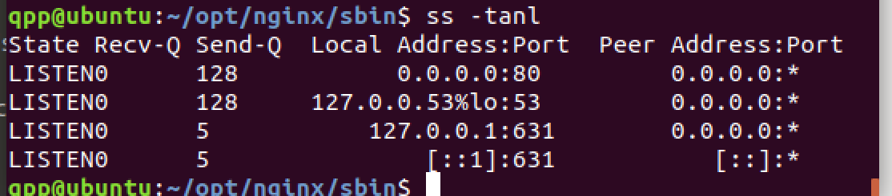

#### nginx概述


Apache ：稳定，开源，跨平台，但是不支持高并发，重量级服务器。
nginx： 轻量级 支持高并发

轻量级 代理服务器 底层c语言 跨平台

优势：
1. 占用内存少
2. 高并发能力强
3. 配置文件通俗易懂
4. 开源免费
5. 支持rewriter 重写
6. 内置自检
7. 节省带宽：gzip，加headers信息  缓存
8. 稳定 反向代理

explains：
1. REST风格：
普通： http://ip:port/query?id=1
REST: http://ip:port/query/1
以统一资源描述符（URI）或者统一资源定位符URL 作为沟通依据，通过HTTP协议提供各种网络服务


安装步骤
--yum install gcc-c++ pcre pcre-devel zlib zlib-devel openssl openssl-devel
新建一个文件夹opt
mkdir nginx-source（放nginx源码）
mkdir nginx（编译后文件）

```shell
mkdir nginx-source
cd nginx-source
## (gcc)
sudo apt-get install build-essential
sudo apt-get install openssl libssl-dev
sudo apt-get install libpcre3 libpcre3-dev
sudo apt-get install zlib1g-dev
## (版本自选)
sudo wget http://nginx.org/download/nginx-1.12.2.tar.gz
## 第三方 （先忽略）sudo wget https://github.com/arut/nginx-rtmp-module/archive/master.zip
sudo tar -zxvf nginx-1.12.2.tar.gz
cd nginx-1.12.2.tar.gz
## 要编译之后放的目录
./configure --prefix=/home/qpp/opt/nginx
make
make install
```

启动nginx
```shell
## 编译之后的目录
cd nginx
cd sbin
sudo ./nginx
ss -tanl
## 查看进程
ps -ef|grep nginx

## stop 找到nginx的进程id 使用kill命令强制杀掉进程 kill -9 xxx
./nginx -s stop
## 等待nginx处理完任务之后停止
./nginx -s quit

./nginx -s reload
```


// master process: 接收请求
// worker progress: 转发请求

**linux 目录**
temp：运行时产生的临时文件
conf： 存放配置文件的目录，有nginx.conf(主配置文件)
html： 欢迎和错误页面
logs： 默认存放了访问日志和错误日志的目录
sbin：默认存放了nginx的二进制命令，常用于nginx的启动，停止等管理操作

#### 详解 nginx.conf 
模块结构
<font color="#f00">一.核心模块</font>
1. HTTP模块（代理，缓存，日志定义，第三方模块）
2. 全局模块（全局指令，日志路径，pid路径，用户信息等）
3. EVENTS模块（网络连接）

<font color="#f00">二.基础模块</font>
1. HTTP全局模块
2. FastCGILI模块
3. HTTP Gzip模块
4. HTTP server模块（虚拟主机，一个http， 可以有多个server）
5. HTTP location模块（请求的路由，各种页面的处理）
6. HTTP Rewrite模块

<font color="#f00">三.第三方模块</font>
1. HTTP Upstream Request Hash模块
2. Notice 模块
3. HTTP Access Key 模块

```shell

# 定义nginx运行的用户和用户组
#user  nobody;

# nginx的进程数，建议设置成cpu的总核心数，默认为1
worker_processes  1;

# 全局错误日志定义类型【debug|info|notice|warn|error|crit】 日志输出日志
#error_log  logs/error.log;
#error_log  logs/error.log  notice;
#error_log  logs/error.log  info;

# 进程pid文件，指定nginx进程运行文件存放地址
#pid        logs/nginx.pid;

# 指定进程可以打开的最大描述符 数目
# 工作模式与连接数上限
# 这个指令是指当一个nginx进程打开的最多文件描述符数目，理论值应该是最多打开文件数（ulinmit-n）与nginx进程数相除，但是nginx分配请求并不是那么均匀，所以最好与ulimit-n 的值保持一致
#现在在linux2.6内核下开启文件打开数为65535，worker_rlimit_nofile 就相应应该为65535，因为nginx调度时分配请求并不是那么均衡，所以假如填写10240，总并发量达到3-4万时就有进程可能超过10240，这时候会返回502
###这里有疑问？？？？？？？？？？？？？？？？？？？？？
# https://blog.csdn.net/sole_cc/article/details/52433353
worker_rlimit_nofile 65535;

# 网络
events {
    worker_connections  1024;
}


http {
    include       mime.types;
    default_type  application/octet-stream;

    #log_format  main  '$remote_addr - $remote_user [$time_local] "$request" '
    #                  '$status $body_bytes_sent "$http_referer" '
    #                  '"$http_user_agent" "$http_x_forwarded_for"';

    #access_log  logs/access.log  main;

    sendfile        on;
    #tcp_nopush     on;

    #keepalive_timeout  0;
    keepalive_timeout  65;

    #gzip  on;

    server {
        listen       80;
        server_name  localhost;

        #charset koi8-r;

        #access_log  logs/host.access.log  main;

        location / {
            root   html;
            index  index.html index.htm;
        }

        #error_page  404              /404.html;

        # redirect server error pages to the static page /50x.html
        #
        error_page   500 502 503 504  /50x.html;
        location = /50x.html {
            root   html;
        }

        # proxy the PHP scripts to Apache listening on 127.0.0.1:80
        #
        #location ~ \.php$ {
        #    proxy_pass   http://127.0.0.1;
        #}

        # pass the PHP scripts to FastCGI server listening on 127.0.0.1:9000
        #
        #location ~ \.php$ {
        #    root           html;
        #    fastcgi_pass   127.0.0.1:9000;
        #    fastcgi_index  index.php;
        #    fastcgi_param  SCRIPT_FILENAME  /scripts$fastcgi_script_name;
        #    include        fastcgi_params;
        #}

        # deny access to .htaccess files, if Apache's document root
        # concurs with nginx's one
        #
        #location ~ /\.ht {
        #    deny  all;
        #}
    }


    # another virtual host using mix of IP-, name-, and port-based configuration
    #
    #server {
    #    listen       8000;
    #    listen       somename:8080;
    #    server_name  somename  alias  another.alias;

    #    location / {
    #        root   html;
    #        index  index.html index.htm;
    #    }
    #}


    # HTTPS server
    #
    #server {
    #    listen       443 ssl;
    #    server_name  localhost;

    #    ssl_certificate      cert.pem;
    #    ssl_certificate_key  cert.key;

    #    ssl_session_cache    shared:SSL:1m;
    #    ssl_session_timeout  5m;

    #    ssl_ciphers  HIGH:!aNULL:!MD5;
    #    ssl_prefer_server_ciphers  on;

    #    location / {
    #        root   html;
    #        index  index.html index.htm;
    #    }
    #}

}
```

#### location 语法
- 参考：https://blog.csdn.net/zwl18210851801/article/details/81699977
  
``location [=|~|~*|^~] /uri/ {...}
``
首先匹配=
其次匹配^~
其次是按照文件中顺序的正则匹配
最后是交给/通用匹配
当有匹配成功时停止匹配 按当前匹配规则处理请求
符号|含义|
-|-|
=|=开头表示精确匹配|
^~|^~开头表示uri以某个常规字符串开头，理解为匹配 url路径即可。nginx不对url做编码，因此请求为/static/20%/aa，可以被规则^~ /static/ /aa匹配到（注意是空格）|
~|~ 开头表示区分大小写的正则匹配|
~*|~* 开头表示不区分大小写的正则匹配|
!~和!~*|!~和!~*分别为区分大小写不匹配及不区分大小写不匹配的正则|
/|用户所使用的代理（一般为浏览器）|
$http_x_forwarded_for|可以记录客户端IP，通过代理服务器来记录客户端的ip地址|
$http_referer|可以记录用户是从哪个链接访问过来的|

#### nginx代理模式

- 正向代理（用的少）

客户端-正向代理服务器-目标服务器（一般设在内网）
客户端在本地配置一些链接到代理服务器，通过代理服务器访问目标服务器发起请求，目标服务器返回数据通过代理服务器

目标服务器不知道用户信息
代理服务器可以保存用户的行为习惯
用户不能直接访问真正的项目

作用：
1. 访问无法访问的资源
2. 做缓存，加速资源访问，缓存命中
3. 限制用户端，对客户端进行访问授权，上网进行认证
4. 代理服务器隐藏用户行为

- 反向代理

对于用户来说，代理服务器相当于真实的服务器，客户端发起请求之后，代理服务器去目标服务器拿数据返给客服端
对于真实服务器来说，代理服务器相当于用户

作用
1. 保证内网的安全，可以使用反向代理提供WAF功能，防止web攻击（别人攻击的只是代理服务器，真实的服务器受保护）
2. 负载均衡，通过代理服务器优化网站负载
代理服务器可以把请求转发到不同的服务器，达到负载作用，通过轮询算法分配请求
当代理服务器不止一个，可以做成集群
减轻单机服务器压力，提高用户体验
upstream 关键词（代码层次）

- 透明代理（了解）

#### nginx 集群搭建


一个nginx 服务器 
三台 应用服务器（确保每个服务器上都有jdk java环境和tomcat）

目标： 直接访问三台服务器没问题，想通过nginx访问三台服务器。
修改配置：
/nginx/conf/nginx.conf
```shell
vi nginx.conf
```
在http模块下面加
```shell
upstream localhost {
    server xxx.xxx.xxx.xxx:8080;
    server xxx.xxx.xxx.xxx:8080;
    server xxx.xxx.xxx.xxx:8080;
}
# 在server模块重定向的地方加
location / {
    proxy_pass: http://localhost;
}
```
#### nginx 负载均衡策略
- 轮询法（默认）
将请求按顺序轮流的方法分配到后端服务器上，均衡对待每一台服务器不关心后端服务器的连接数和当前的系统负载
```shell
upstream server_name_tomcat {
    server xxxxxxx;
    server xxxxxxx;
    ...
}
```
- 加权轮询法（weight）
不同的后端服务器可能机器的配置和当前系统的负载并不相同，因此他们的抗压能力也不相同
给配置高，负载低的服务器配置更高的权重，让其处理更多的请求
配置低，负载高的服务器，分配其较低的权重，降低其系统负载
加权轮询法能更好的将请求按权重高低分配到后端
weight的值越大分配到的访问概率越高
```shell
    upstream server_name_tomcat {
        server xxx weight = 1;
        server xxx weight = 2;
        ...
    }
```
- 源地址哈希法
根据获取客户端的ip地址，通过哈希函数计算得到一个数值
用该数值对服务器列表的大小进行取模运算，得到的结果便是客户端要访问服务器的序号
采用源地址哈希法进行负载均衡，同一ip地址的客户端，当后端服务器列表不变时，它每次都会映射到同一后端服务器访问
可保证同一ip地址的请求被打到固定的机器上，可以解决session的问题
```shell
upstream server_name_tomcat {
    ip_hash;
    server xxx weight=1;
    server xxx weight=2;
    ...
}
```
- 最小连接数法
由于后端服务器的配置都不一样，对请求的处理有快有慢，最小连接数法根据后端服务器当前的连接情况，动态的选取当前挤压连接数最小的一台服务器来处理当前的请求，尽可能的提高后端服务器的连接效率，将负责合理的分流到每台服务器
```shell
upstream server_name_tomcat {
    least_conn;
    server xxx weight=1;
    server xxx weight=2;
    ...
}
```
- 第三方模块算法
 1 Fair 比weight，ip_hash 更智能的负载均衡算法（调度算法）
 可以根据页面大小和加载时间长短智能地进行负载均衡，也就是根据后端服务器的响应时间分配请求，响应时间短的优先分配请求
 nginx本身不支持Fair，如果需要这种负载均衡算法，需要安装upstream_fair 模块
 ```shell
 upstream server_name_tomcat {
     fair;
     server xxx weight=1;
     server xxx weight=1;
 }
 ```

下载fair https://github.com/gnosek/nginx-upstream-fair
解压 unzip  nginx-upstream-fair-master.zip
切换到Nginx 源文件目录执行一下操作
 ./configure --prefix=/opt/nginx --add-module=/opt/nginx-upstream-fair-master
 编译 make
 make install

 已安装Nginx，配置第三方模块时，只需要--add-module=/第三方模块目录，然后make编译一下就可以
 遇到 default_port问题修改
```shell
cd nginx-upstream-fair-master
sed -i 's/default_port/no_port/g'ngx_http_upstream_fair_module.c
```

 2 url_hash
 按访问的URL的哈希结果来分配请求，使每个url定向到一台后端服务器
 可以进一步提高后端缓存服务器的效率
 nginx本身不支持url_hash 如果需要这种负载均衡算法，需要安装nginx的hash软件包
 ```shell
 upstream server_name_tomcat {
     hash $request_uri;
     server xxx weight=1;
     server xxx weight=1;
     ...
 }
 ```
 下载hash https://github.com/evanmiller/nginx_upstream_hash
 解压 unzip  nginx_upstream_hash.zip
 切换到Nginx 源文件目录执行一下操作
 ./configure --prefix=/opt/nginx --add-module=/opt/nginx_upstream_hash
 编译 make
 make install
 
 #### 日志管理和日志切割

通过访问日志，可以得到用户的地域来源，跳转来源，使用终端，某个url访问量等问题
通过错误日志，可以得到系统某个服务或server的性能瓶颈等

nginx 日志相关的配置 包括 access_log 、 log_format 、 open_log_file_cache 、 rewrite_log 、 error_log

日志生成的到根目录/logs/access.log 文件，默认使用‘main’日志格式，也可以自定义格式
log_format main '$remote_addr - $remote_user [$time_local] '
'"$request" $status $body_bytes_sent '
'"$http_referer" "$http_user_agent"';


- nginx 日志类型

- nginx 日志切割
nginx 日志文件没有rotate功能
编写每天生成一个日志，可以写一个日志切割脚本自动切割日志文件

思路：
第一步就是重命名日志文件（不用担心重命名后nginx找不到日志文件而丢失日志，在你未打开原名字的日志文件之前，nginx还是会向你重命名的文件写日志，linux是靠文件描述符而不是文件名定位文件的）
第二步向nginx主进程发送USR1信号
 * nginx主进程接到消息后会从配置文件中读取日志文件名称
 * 重新打开日志文件（以配置文件中的日志名称命名），并以工作进程的用户作为日志文件的所有者
 * 重新打开日志文件后，nginx主进程会关闭重名的日志文件并通知工作进程使用新打开的日志文件
 * 工作进程立即打开新的日志文件，并关闭重名的日志文件
 * 然后就可以处理旧的日志文件了（或者重启nginx服务）

```shell
vi /opt/nginx/nginx_log.sh
```

```shell
#! /bin/bash
# 设置日志文件存放目录
LOG_HOME="/opt/nginx/logs/"
#备份文件名称
LOG_PATH_BAK = "$(date -d yesterday+%Y%m%d%H%M)".access.log
#重命名日志文件
mv ${LOS_HOME}/access.log ${LOG_HOME}/${LOG_PATH_BAK}.log
#向nginx主进程发送信号重新打开日志
kill -USR1 `cat /opt/nginx/logs/nginx.pid`
```

执行定时任务

创建crontab设置作业
设置日志文件存放目录 crontab -e
```shell
*/1 * * * * sh /opt/nginx/nginx_log.sh
```

重启定时任务：
service crond restart

#### nginx 集群搭建-动静分离
概念：读写分离
静态资源文件，搭建静态资源服务器
nginx动静分离简单来说就是把动态和静态请求分离开，不能理解成把静态页面和动态页面物理分割
严格意义上来说把动态请求和静态请求分离开，可以理解成用nginx处理静态请求，tomcat处理动态请求
从目前实现角度来说有两种：
1. 一种纯粹是把静态文件独立成单独 的域名，放在独立的服务器上，也是目前主流推崇的方案
2. 一种是动态和静态文件混合在一起发布，通过nginx分离

```shell
location ~.*\.\(html|jpg|png|svg|css...)$ {
    root /opt/nginx/static/;
    expires 30d;
}
```

#### nginx 高并发架构分析

高并发是指互联网分布式系统架构设计中必须要考虑的因素之一，他通常是指，通过设计保证系统能够同时并行处理很多请求。

高并发一些常用的相关指标有：响应时间，吞吐量，每秒查询率qps，并发用户数等。

响应时间： 系统对请求作出响应的时间

吞吐量： 单位时间内处理的请求数量

qps：每秒响应请求数

**如何提升系统的并发能力？**
垂直扩展：
提示单机处理能力
  增强单机硬件性能
  提升系统架构能力
水平扩展（水平拆分）：只要增加服务器数量，就能线性扩充系统性能（理论上）


反向代理层的水平扩展
是通过dns轮询实现的，一个域名可以解析多个ip地址
当nginx遇到瓶颈时，可以加代理服务器，增加一个外网ip，扩展反向代理层的性能，理论上达到无限高并发

站点层：
 站点层的水平扩展，是通过“nginx”实现的。通过修改nginx.conf，可以设置多个web后端。当web后端成为瓶颈的时候，只要增加服务器数量，新增web服务的部署，在nginx配置中配置上新的web后端，就能扩展站点层的性能，做到理论上的无限高并发。

服务层：
站点层通过RPC-client调用下游的服务层RPC-server时，RPC-client中的连接池会建立与下游服务多个连接，当服务成为瓶颈的时候，只要增加服务器数量，新增服务部署，在RPC-client处建立新的下游服务连接，就能扩展服务层性能，做到理论上的无限高并发。如果需要优雅的进行服务层自动扩容，这里可能需要配置中心里服务自动发现功能的支持。

数据层：
    在数据量很大的情况下，数据层（缓存，数据库）涉及数据的水平扩展，将原本存储在一台服务器上的数据（缓存，数据库）水平拆分到不同服务器上去，以达到扩充系统性能的目的。

互联网分层架构中，各层次水平扩展的实践又有所不同：

反向代理层可以通过“DNS轮询”的方式来进行水平扩展；
站点层可以通过nginx来进行水平扩展；
服务层可以通过服务连接池来进行水平扩展；
数据库可以按照数据范围，或者数据哈希的方式来进行水平扩展。
各层实施水平扩展后，能够通过增加服务器数量的方式来提升系统的性能，做到理论上的性能无限。


#### nginx配置限流
limit conn zone
limit_req_zone
ngx_http_upstream_module
前两种只能对客户端限流，即单一ip限流
压力测试工具
ab工具

```shell
limit conn zone $binary_remote_addr zone=10m;
server{
    ## 客户端的并发链接数只能是10个
    ...
    limit conn one 10;
    ...
}
```
limit conn one 10 既可以放在server，只对server有效，也可以放在location对单个location有效

limit_req_zone
```shell
http{
    # 对ip地址限流 zone=req_one 开辟地址空间的名称 10m
    limit_req_zone $binary_remote_addr zone=req_one:10m rate=1r/s;
    server{
        ...
        limit_req_zone=req_one burst=120;
        ...
    }
}
```
其中 limit_req_zone = req_one burst=120 既可以放在server只对server有效，也可以放在location对单个location有效
rate=1r/s 表示每个地址每秒只能请求一次，也就是说令牌桶burst=120一共有120块令牌,并且每秒钟只新增一块令牌，120块令牌发完后，多出来的请求就会返回503

ngx_http_upstream_module
nginx第三方模块
该模块提供了我们需要的后端限流功能
参数：最大连接数：max_conns
```shell
upstream{
    server 127.0.0.1:8080 max_conns=10;
    server 127.0.0.1:8081 max_conns=10;
}
```

#### 高并发下nginx安全配置

-版本安全
  一般请求的响应头会带出server:nginx/1.13.x 这种信息，nginx官网上某个版本有漏洞会很清晰的给出，我们要隐藏掉版本信息，需要在http里面加 server_tokens off;
-ip安全
白名单

```shell
location{
    allow 127.0.0.1;
    deny all;
}
```

黑名单

```shell
location{
    deny 127.0.0.1;
    allow all;
}
```

-文件安全
-连接安全
https ssl证书

#### nginx配置进程数，并发数，系统优化

- 调整nginx主配置文件，增加并发量

```shell
#调整至与CPU数量一致
worker processes 2;
event {
    worker connection 65535; # 每个worker最大并发连接数
}
 ```

 - 调整内核参数

```shell
ulimit -a # 查看所有的属性值
ulimit -Hn 1000 # 临时设置硬限制（服务器关闭就会失效）
ulimit -Sn 1000 # 临时设置软限制
vim /etc/security/limits.conf # 永久改变
```

#### 高并发下nginx长连接

nginx的长连接短连接，可以增强服务器的容灾能力
HTTP1.1 之后 HTTP协议支持持久连接，在一个TCP连接上可以传送多个HTTP请求和响应，减少了建立和关闭连接的消耗和延迟，如果我们使用nginx做负载均衡和反向代理，从客户端发过来的长连接就会被转换成短连接发送给服务器端，为了支持长连接，做一些配置
要求：
1. client到nginx是长连接 
2. nginx到server是长连接
要做到clint到nginx是长连接，需要 
1. client发送过来的请求携带keep-alive header 
2. nginx设置支持keep-alive

#### 高并发下nginx压缩
gzip压缩作用：将响应报文发送给客户端之前可以启用压缩功能，可以有效的节约带宽，并提高响应至客户端的速度。压缩会消耗nginx 的cpu性能
gzip可以配置在http，server，location模块下

#### 高并发下nginx状态监控
配置nginx的监控选项：nginx.conf
```shell
#设定nginx状态访问地址
location /NginxStatus {
    stub_status on; #开启监控功能
    access_log off;
}
```
插件安装（nginx源码包中执行安装）
./configure --prefix=/opt/nginx/ --with-http_stub_status_module
配置完成重启nginx

**nginx status详解**
active connections – 活跃的连接数量
server accepts handled requests — 总共处理了11989个连接 , 成功创建11989次握手, 总共处理了11991个请求
reading — 读取客户端的连接数，（读取客户端的header信息数，只读取header信息然后立马进入waiting状态）
writing — 响应数据到客户端的数量，这个操作不仅要读取头部，还要等待服务响应
waiting — 开启 keep-alive 的情况下,这个值等于 active – (reading+writing), 意思就是 Nginx 已经处理完正在等候下一次请求指令的驻留连接.

查看nginx的并发进程数：
ps -ef|grep nginx | wc -l
查看web服务器TCP连接状态：netstat -n | awk '/^tcp/ {++S[$NF]} END {for(key in S) print key,"\t",S[key]}'

#### ab工具（压力测试）
Apache自带的ab压力测试工具
ab是apachebench命令的缩写。
ab的原理：ab命令会创建多个并发访问线程，模拟多个访问者同时对某一URL地址进行访问。它的测试目标是基于URL的，因此，它既可以用来测试apache的负载压力，也可以测试nginx、lighthttp、tomcat、IIS等其它Web服务器的压力。

ab命令对发出负载的计算机要求很低，它既不会占用很高CPU，也不会占用很多内存。但却会给目标服务器造成巨大的负载，其原理类似CC攻击。自己测试使用也需要注意，否则一次上太多的负载。可能造成目标服务器资源耗完，严重时甚至导致死机。

Ubuntu 安装
```shell
sudo apt-get install apache2-utils
```

centos 
```shell
sudo yum install httpd-tools
```

ab [options] [http://]hostname[:port]/path

例如：ab -n 5000 -c 200 http://localhost/index.php

ab常用参数的介绍：

-n ：总共的请求执行数，缺省是1；

-c： 并发数，缺省是1；

-t：测试所进行的总时间，秒为单位，缺省50000s

-p：POST时的数据文件

-w: 以HTML表的格式输出结果

ab性能指标
在进行性能测试过程中有几个指标比较重要：

1、吞吐率（Requests per second）

服务器并发处理能力的量化描述，单位是reqs/s，指的是在某个并发用户数下单位时间内处理的请求数。某个并发用户数下单位时间内能处理的最大请求数，称之为最大吞吐率。

记住：吞吐率是基于并发用户数的。这句话代表了两个含义：

a、吞吐率和并发用户数相关

b、不同的并发用户数下，吞吐率一般是不同的

计算公式：总请求数/处理完成这些请求数所花费的时间，即

Request per second=Complete requests/Time taken for tests

必须要说明的是，这个数值表示当前机器的整体性能，值越大越好。

2、并发连接数（The number of concurrent connections）

并发连接数指的是某个时刻服务器所接受的请求数目，简单的讲，就是一个会话。

3、并发用户数（Concurrency Level）

要注意区分这个概念和并发连接数之间的区别，一个用户可能同时会产生多个会话，也即连接数。在HTTP/1.1下，IE7支持两个并发连接，IE8支持6个并发连接，FireFox3支持4个并发连接，所以相应的，我们的并发用户数就得除以这个基数。

4、用户平均请求等待时间（Time per request）

计算公式：处理完成所有请求数所花费的时间/（总请求数/并发用户数），即：

Time per request=Time taken for tests/（Complete requests/Concurrency Level）

5、服务器平均请求等待时间（Time per request:across all concurrent requests）

计算公式：处理完成所有请求数所花费的时间/总请求数，即：

Time taken for/testsComplete requests

可以看到，它是吞吐率的倒数。

同时，它也等于用户平均请求等待时间/并发用户数，即

Time per request/Concurrency Level


// tip
apt-get install build-essential
首先使用dpkg命令查看自己需要的软件是否安装。
```shell
dpkg -l | grep zlib
```
解决依赖包openssl安装，命令：
```shell
sudo apt-get install openssl libssl-dev
```
解决依赖包pcre安装，命令：
```shell
sudo apt-get install libpcre3 libpcre3-dev
```
解决依赖包zlib安装，命令：
```shell
sudo apt-get install zlib1g-dev
```

